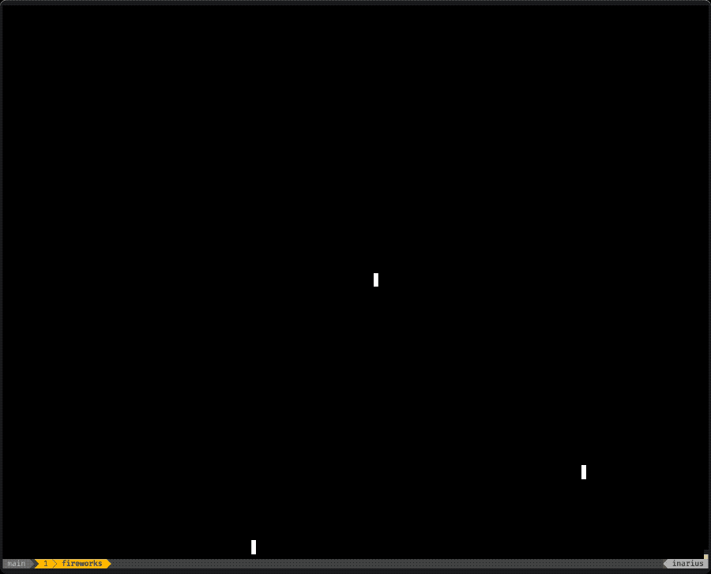

# 🎨 Pixel Loop 🔁

## **WORK IN PROGRESS**
This crate/library is still heavily being worked on. The API is not considered to be stable at this point in time. If you want to follow the development check out the following youtube channel [MrJakob](https://youtube.com/c/mrjakob).

## Overview

Pixel Loop is a Rust implementation inspired by the concepts discussed in the [article on fixed time game/update loops by Gaffer on Games](https://gafferongames.com/post/fix_your_timestep/). The current implementation leverages [winit](https://crates.io/crates/winit) and [pixels](https://crates.io/crates/pixels) for window initialization and drawing capabilities, or [crossterm](https://crates.io/crates/crossterm) to drawn to the terminal using unicode. The intention is to further generalize this implementation in the future.

## Motivation

The idea behind Pixel Loop resonated with me as I have often faced challenges with timing aspects while working on animations from scratch. This project serves as a practical exploration of fixed time game/update loops and lays the groundwork for future experiments and projects.

## Subprojects

This repository housed a couple of different experiments implemented based on `pixel_loop`. Those have now been moved to their own repositories/locations, as the library is published on crates.io.

You can find the old subprojects here:

**TODO: MOVE AND LINK**

* [pixel_sand](src/pixel_sand/README.md) - A sand movement simulator.
* [tetromino_time](src/tetromino_time/README.md) - A Tetromino based timer.
* [trivial_cli_demo](src/trivial_cli_demo/README.md) - A trivial demo showing the CLI/Shell Unicode and ANSI based output driver.
* [shell_smash](src/shell_smash/README.md) - A simple breakout clone running in your Terminal.
* [fireworks](src/fireworks/README.md) - Fireworks particle simulation in your Terminal

## Gallery

**TODO: WHERE TO PUT THAT?**





## Build Instructions

To build Pixel Loop using Cargo, execute the following command:

```shell
cargo build --release
```
