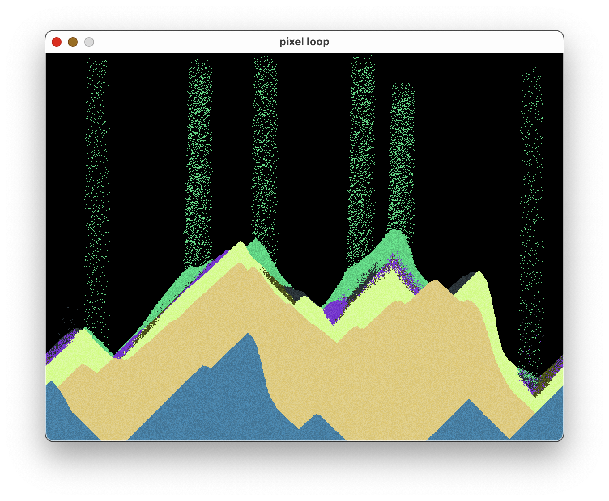
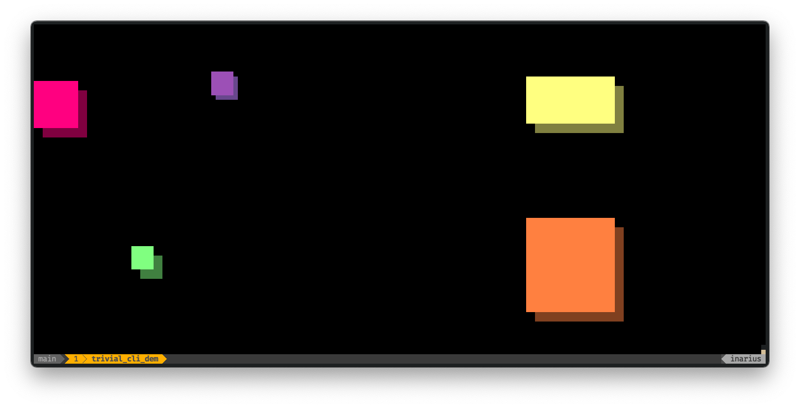
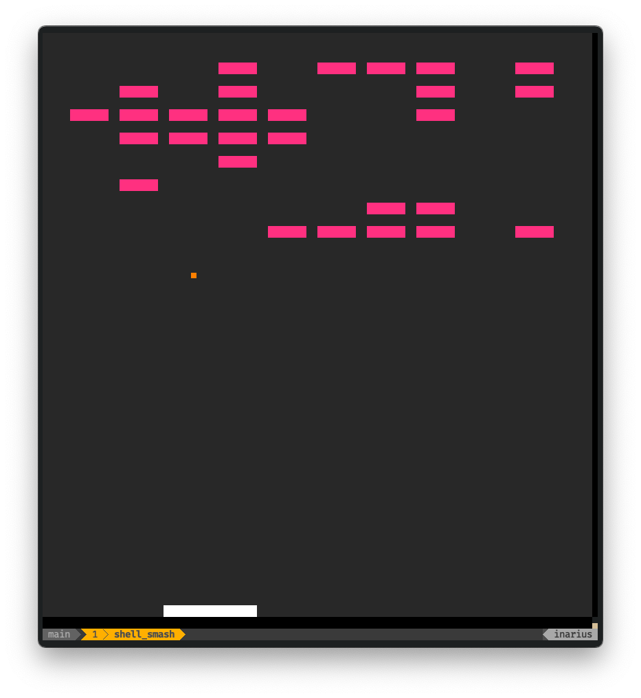

# 🎨 Pixel Loop 🔁

**WORK IN PROGRESS**

## Overview

Pixel Loop is a Rust implementation inspired by the concepts discussed in the [article on fixed time game/update loops by Gaffer on Games](https://gafferongames.com/post/fix_your_timestep/). The current implementation leverages [tao](https://crates.io/crates/tao) and [pixels](https://crates.io/crates/pixels) for window initialization and drawing capabilities. The intention is to further generalize this implementation in the future.

## Motivation

The idea behind Pixel Loop resonated with me as I have often faced challenges with timing aspects while working on animations from scratch. This project serves as a practical exploration of fixed time game/update loops and lays the groundwork for future experiments and projects.

## Subprojects

Currently, this repository houses different experiments implemented based on `pixel_loop` while it is still under development. They are within their appropriate subfolder in the `src` folder. Each of them has its separate README in the corresponding directory.

Currently, there are the following:

* [pixel_sand](src/pixel_sand/README.md) - A sand movement simulator.
* [tetromino_time](src/tetromino_time/README.md) - A Tetromino based timer.
* [trivial_cli_demo](src/trivial_cli_demo/README.md) - A trivial demo showing the CLI/Shell Unicode and ANSI based output driver.
* [shell_smash](src/shell_smash/README.md) - A simple breakout clone running in your Terminal.

## Gallery








## Build Instructions

To build Pixel Loop and all its subproject binaries using Cargo, execute the following command:

```shell
cargo build --release
```

## Running the Applications

Once built, all the application binaries are available under `target/release/`. To run, for example, the `pixel_sand` application, execute:

```
target/release/pixel_sand
```

## Using the Library

To use the library, simply check it out and depend on it. Please note that it is currently not available on crates.io until it reaches a more mature state.
