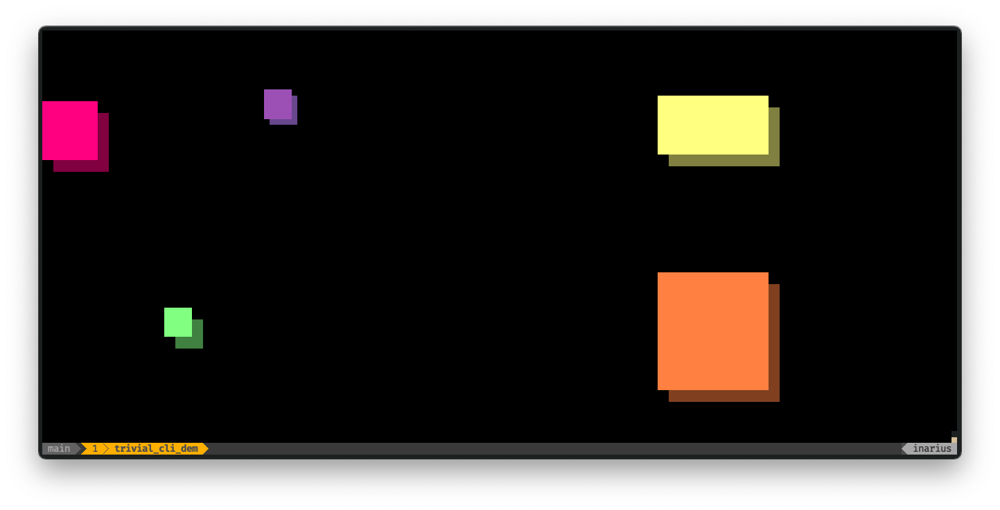

# 💻 Trivial CLI Demo ⚙️

## Overview

The `trivial_cli_demo` is a very simple demonstration of the Crossterm Output Driver for PixelLoop, which allows rendering to a shell console using unicode characters and ansi colors.

## Build Instructions

To build the Trivial CLI Demo run `cargo build --release`.

## Usage

Once built, run the `targets/release/trivial_cli_demo` binary to start the demo. Use the `arrow keys` to move the violet rectangle around. Press `space` to randomize colors and `q` to exit.

