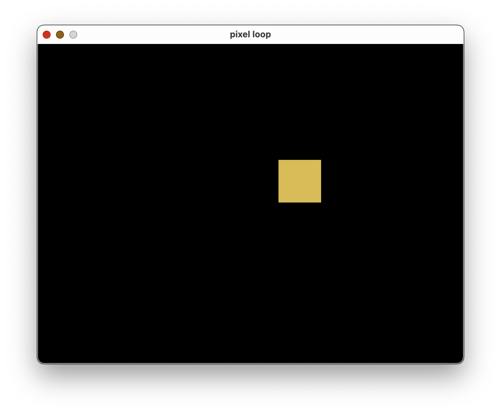

# 🖥️ Trivial Pixels Demo ⚙️

## Overview

The `trivial_pixels_demo` is a very simple demonstration of the Winit/Pixels Output Driver for PixelLoop, which allows rendering to a gpu backed window surface.

## Build Instructions

To build the Trivial Winit Demo run `cargo build --release`.

## Usage

Once built, run the `targets/release/trivial_pixels_demo` binary to start the demo.

