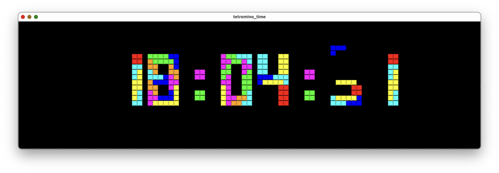

# 🎮 Tetromino Time 🕙

## Overview
Tetromino Time is a clock/stopwatch based on [pixel_loop](http://github.com/jakobwesthoff/pixel_loop), utilizing Tetrominos to "build up the time to display".

## Acknowledgement

This project draws inspiration from and is based on the work of [Mike Swan (n00dles)](https://github.com/n00dles) and his [esp_p10_tetris_clock](https://github.com/n00dles/esp_p10_tetris_clock) designed for ESP microcontrollers and LED matrix displays, licensed under the MIT license.

Kudos to Mike for his outstanding work and the inspiration provided!

## Build Instructions
To build the Tetromino Timer in conjunction with the Pixel Loop engine, refer to the build instructions outlined in the main Pixel Loop repository.

## Usage
Upon successful build, execute the `tetromino_time` binary to initiate the clock.

Use the `--stopwatch` argument, to spawn it as a timer/stopwatch.
